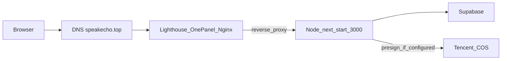

# Deploy SpeakEcho (Next.js) on Tencent Lighthouse + 1Panel + speakecho.top

Use this after ICP备案 is done. Goal: fresh production build, HTTPS domain, 1Panel for ops.

## Architecture



## What you are deploying

- Only the **`web/`** Next.js app (Node). Supabase is hosted separately; COS is object storage.
- Production runs `npm run build` then `npm start` (default port **3000**). A reverse proxy (OpenResty/Nginx via 1Panel) terminates TLS and forwards to `127.0.0.1:3000`.

## 0) Prerequisites checklist

- **DNS**: `speakecho.top` (and optionally `www`) **A record** → Lighthouse **公网 IP**. TTL as you prefer.
- **Firewall**: In Tencent console (security group + 轻量 firewall template), allow at least **22** (SSH), **80**, **443**. Open **1Panel HTTPS port** when you install it (installer prints it; often **24377** or similar—use the official doc’s current default).
- **Secrets**: Copy values from local [`.env.example`](../.env.example) into a server-side env file (see §5). Never commit real keys.
- **Optional but recommended**: Private Git repo (GitHub/GitLab/Gitee) so the server can `git pull`. Otherwise upload a tarball/SCP.

## 1) Install 1Panel on the server

1. SSH into the Lighthouse instance as root or sudo user.
2. Follow the **official** 1Panel install script from [1Panel docs](https://1panel.cn/docs/installation/cli_install/) (Linux one-liner). Example pattern (verify URL on their site before running):

   ```bash
   curl -sSL https://resource.fit2cloud.com/1panel/package/quick_start.sh -o quick_start.sh && sudo bash quick_start.sh
   ```

3. When finished, note the **panel URL**, **port**, and **initial password**.
4. In Tencent firewall / security group, **allow inbound TCP** on that panel port from **your IP** first (or temporarily from `0.0.0.0/0` only while hardening—then restrict).
5. Open the panel in the browser → set a strong password, enable 2FA if available.

## 2) Install Node.js (LTS) for Next.js 16

- In 1Panel: use **App Store / Runtime** (or system package) to install **Node.js 20 LTS** (or newer supported LTS). Next.js 16 needs a recent Node.

Verify in SSH:

```bash
node -v   # e.g. v20.x
npm -v
```

## 3) Fresh deploy layout on the server

Pick an app root (example):

```text
/opt/speakecho/web
```

### Option A — Git on server (recommended)

```bash
sudo mkdir -p /opt/speakecho && sudo chown "$USER:$USER" /opt/speakecho
cd /opt/speakecho
git clone <your-private-repo-url> speak_echo
cd speak_echo/web
```

Later updates:

```bash
cd /opt/speakecho/speak_echo && git pull
cd web && npm ci && npm run build
# restart process manager (see §6)
```

### Option B — Build on your PC, upload artifact

Possible but more error-prone (OS/arch, native deps). Prefer **Option A** and build on Linux.

## 4) Remove or replace the old deployment (optional but “全新”)

Before going live:

1. In 1Panel(or SSH), **stop** the old Node/PM2/Docker site that served the previous build.
2. **Backup** old directory if needed (`tar czf ~/speakecho-old.tgz ...`), then remove or point the site root to the new `/opt/speakecho/...` path.
3. Do **not** wipe the whole OS unless you want a clean slate; 1Panel and Node can stay.

## 5) Environment variables (production)

On the server, create `/opt/speakecho/speak_echo/web/.env.production` (or use 1Panel’s env UI for the process) with at least:

| Variable | Purpose |
|----------|---------|
| `NEXT_PUBLIC_SUPABASE_URL` | Supabase project URL |
| `NEXT_PUBLIC_SUPABASE_ANON_KEY` | Public anon key |
| `SUPABASE_SERVICE_ROLE_KEY` | Server-only (activation/admin flows)—keep secret |
| `PUBLISH_API_TOKEN` | Optional; if set, [`publish-video`](../app/api/publish-video/route.ts) requires header `x-publish-token` |
| `COS_SECRET_ID` / `COS_SECRET_KEY` | If using private COS signing |
| `SPEAKECHO_ADMIN_PHONES` | Admin phone allowlist (optional if using DB `admins` table) |

Next loads `.env.production` automatically when `NODE_ENV=production`.

Copy from your local `.env.local` and adjust—**do not** upload `.env.local` to a public repo.

## 6) Build and run Node (process manager)

From `web/`:

```bash
npm ci
npm run build
```

Run in production (pick one):

- **PM2** — from the `web/` directory after `npm run build`:
  - `pm2 start ecosystem.config.cjs` (uses [ecosystem.config.cjs](../ecosystem.config.cjs)), then `pm2 save` and enable startup via `pm2 startup` or 1Panel.
  - Or: `pm2 start npm --name speakecho-web -- start` with **cwd** set to `web/`.
- **1Panel “网站 / 运行环境”**: create a Node project pointing at `web/`, start command `npm start`, working directory `web/`, env from file or UI.

Ensure **only one** process binds to **3000**.

## 7) Reverse proxy + SSL in 1Panel

1. **网站** → **创建网站** → 类型选 **反向代理**（或先创建静态站再改反代，以你面板版本为准）。
2. **主域名**: `speakecho.top`，按需加 `www.speakecho.top`。
3. **代理目标**: `http://127.0.0.1:3000`（HTTP，本机回环；TLS 由面板终止）。
4. 若面板提供 **WebSocket** 相关选项，可按需开启（部分 Next 场景会用到；以面板说明为准）。
5. **HTTPS**: 申请 **Let’s Encrypt** 证书（需 **80/443** 已放行且 DNS 已指向本机）。
6. **强制 HTTPS**（HTTP → HTTPS 跳转）在面板里打开。

## 8) Supabase auth URL (production)

In Supabase Dashboard → Authentication → URL configuration, set **Site URL** to `https://speakecho.top` and add **Redirect URLs** for your auth paths (`/auth/*`) as needed. Wrong URLs cause login redirect loops or failures.

## 9) COS image hostname (if applicable)

[`next.config.ts`](../next.config.ts) lists `images.remotePatterns`. If your bucket hostname differs from the example, add your COS hostname there and redeploy.

## 10) Desktop uploader after go-live

1. Copy [`uploader-desktop/data/config.example.json`](../../uploader-desktop/data/config.example.json) to `uploader-desktop/data/config.json` (local only; `config.json` is gitignored).
2. Set **`publish_api_url`** to `https://speakecho.top/api/publish-video`.
3. Set **`publish_api_token`** to the same value as server **`PUBLISH_API_TOKEN`** (header `x-publish-token`; see [`publish-video` route](../app/api/publish-video/route.ts)).

## 11) Smoke test

- `https://speakecho.top` loads.
- Login/signup (if using Supabase auth) works.
- Admin/API routes behave as expected.
- Optional: `curl -I https://speakecho.top/api/...` for quick headers check.

## Troubleshooting

| Symptom | Likely cause |
|---------|----------------|
| 502 / blank page | PM2 or Node not running; `next start` port mismatch vs reverse proxy |
| Certificate (SSL) fails | DNS A record; port **80** in use or blocked by firewall |
| Supabase login fails | **Authentication → URL configuration**: Site URL / Redirect URLs must include `https://speakecho.top` (and `www` if used) |
| Video will not play (private COS) | `COS_SECRET_ID` / `COS_SECRET_KEY` set; bucket policy matches URL host in DB |
| Connection refused on publish from PC | Uploader `publish_api_url` still `localhost:3000`; use HTTPS domain |
| Mixed content / auth errors | `NEXT_PUBLIC_*` not set in production env; rebuild after env change |

## Reference in repo

- Local dev: [README.md](../README.md)
- Env template: [`.env.example`](../.env.example)
